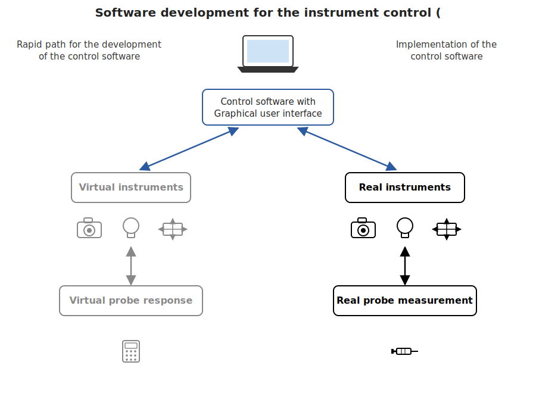

# Viscope

Viscope is a Python-based framework for instrument control. While other
packages address this topic, Viscope's strength is the ability to develop
and debug data acquisition procedures without needing any physical
instrument. This approach speeds up code development and minimizes the
risk of damaging the instrument.

This is the base package for a virtual/real microscope controlling system.

The same control software and GUI drive either a virtual instrument (gray
path, response is only calculated) or a real one (black path, an actual
physical measurement) -- swapping one for the other requires no change to
the software above it.

See [docs/installation.md](docs/installation.md) for setup instructions and [docs/extensions.md](docs/extensions.md) for add-on packages.
