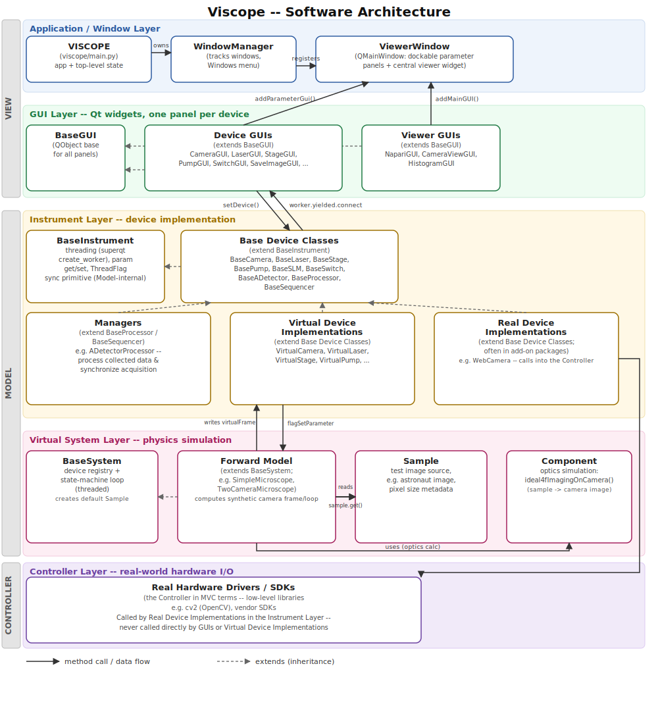
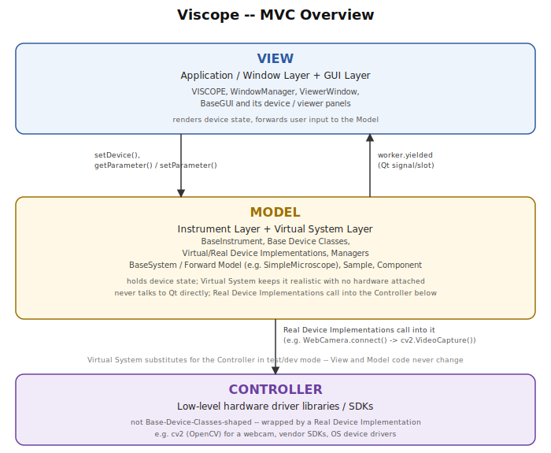

# Software Architecture

Viscope separates concerns into five layers, which map onto a classic
**Model / View / Controller** split: the Application/Window Layer and GUI
Layer together are the **View**, the Instrument Layer and Virtual System
Layer together are the **Model**, and the low-level hardware driver
libraries/SDKs (e.g. `cv2`) that Real Device Implementations call into are
the **Controller**. GUI code never talks to real hardware directly, and
instrument code never talks to Qt directly -- this is what makes it possible
to develop and test against a **virtual microscope** and swap in real
hardware later without touching the View or Model code.

See [MVC Overview](#mvc-overview) below for the same idea distilled to three
boxes.

## Layers

### Application / Window Layer (View)

[`VISCOPE`](reference/main.md) (`viscope/main.py`) is the single entry point
of an application. It owns the `QApplication`, a `WindowManager`, and the
main `ViewerWindow`. Every GUI panel that gets created registers itself in
`VISCOPE.GUIList`.

[`WindowManager`](reference/gui/window/viewerWindow.md) tracks every open
`ViewerWindow`, designates the first one as the "top" window, and keeps a
"Windows" menu on that top window in sync -- closing the top window closes
all managed windows.

[`ViewerWindow`](reference/gui/window/viewerWindow.md) is a `QMainWindow`
that hosts a central viewer widget (`addMainGUI`) and any number of
dockable, tabified parameter panels (`addParameterGui`).

### GUI Layer (View)

[`BaseGUI`](reference/gui/baseGUI.md) is the common base (a `QObject`) for
every panel. It attaches to a `ViewerWindow` (the main one, or a new one)
and to a device via `setDevice()`. Concrete GUIs connect Qt's signal/slot
mechanism directly to that device's worker thread --
`self.device.worker.yielded.connect(self.guiUpdateTimed)` -- so every
`yield` inside the instrument's `loop()` (see the Instrument Layer below)
triggers a GUI update. `guiUpdateTimed()` then rate-limits how often the
actual redraw happens, so a fast-streaming device doesn't flood the Qt
event loop.

Concrete GUIs extend `BaseGUI` directly, in two flavors:

- **Device GUIs** -- one panel per instrument type
  (`CameraGUI`, `LaserGUI`, `StageGUI`, `PumpGUI`, `SwitchGUI`, `aDetectorGUI`,
  `SaveImageGUI`, ...), docked as parameter panels. `SaveImageGUI` belongs
  here, not with the viewers -- it doesn't display anything, it just reads
  `device.rawImage` and writes it to disk via a docked `magicgui` panel.
- **Viewer GUIs** -- image/data viewers (`NapariGUI`, `CameraViewGUI`,
  `HistogramGUI`) set as the central widget.

`AllDeviceGUI` isn't a third category -- it's just a thin wrapper that
instantiates several Device GUIs at once, which is why most virtual-system
examples use it to get a full control UI in one call.

Together, the Application/Window Layer and the GUI Layer are the **View**:
they render device state and forward user input to the Model, and hold no
device logic of their own.

### Instrument Layer (Model -- device implementation)

[`BaseInstrument`](reference/instrument/base/baseInstrument.md) provides
what every instrument needs regardless of what it controls: an optional
background thread (`superqt.create_worker` running `loop()`) and a
`getParameter`/`setParameter` interface. It also defines `ThreadFlag`, a
thread-safe event -- but that's a Model-internal synchronization primitive
(see below), *not* how the GUI is notified of new data; that's a plain Qt
signal/slot connection, described in the GUI Layer above.

Each device type has a **base class** describing its interface
(`BaseCamera`, `BaseLaser`, `BaseStage`, `BasePump`, `BaseSLM`, `BaseSwitch`,
`BaseADetector`, `BaseProcessor`, `BaseSequencer`), and this layer holds
three kinds of concrete implementation of it, side by side:

- **Managers** -- extensions of `BaseProcessor` and `BaseSequencer` (e.g.
  `ADetectorProcessor`) responsible for processing already-collected data
  and synchronizing multi-device acquisition, rather than talking to a
  device directly. They do not communicate with the Forward Model.
- **Virtual Device Implementations** (`VirtualCamera`, `VirtualLaser`, ...)
  so GUIs and application logic can be developed and tested with no
  hardware attached.
- **Real Device Implementations** (e.g. `WebCamera`, often shipped in
  add-on packages such as `spectralCamera`) that wrap actual hardware.

All three extend the same Base Device Classes, so a GUI built against
`BaseCamera` works unmodified whether the concrete device is virtual or
real -- this layer only holds the device *interface and state*. A Real
Device Implementation is still Model code; it just happens to call into a
Controller (a lower-level driver library, e.g. `cv2`) to do the actual I/O
-- see the Controller Layer below.

### Virtual System Layer (Model -- simulation, test/dev only)

This layer only exists to make the virtual instruments produce believable
data -- it has no real-hardware equivalent, and substitutes for the
Controller during development.

[`BaseSystem`](reference/virtualSystem/base/baseSystem.md) holds a registry
of virtual devices and a default `Sample`, and runs its own threaded
state-machine loop. The concrete **Forward Model** classes that extend it
-- [`SimpleMicroscope`](reference/virtualSystem/simpleMicroscope.md) and
`TwoCameraMicroscope` -- are to `BaseSystem` what `VirtualCamera` is to
`BaseCamera`: one interface, several concrete simulations. A Forward Model
interacts directly with the **`Sample`** (calling `sample.get()` for the
current test image) on every loop iteration. When a device's parameters
have changed, it then uses [`Component`](reference/virtualSystem/component/component.md)
(e.g. `ideal4fImagingOnCamera`) to compute an optically-simulated frame from
that sample and writes it into the virtual device (`device.virtualFrame`).

The virtual devices and the Forward Model talk to each other **only
through flags**, never through direct method calls in either direction:

- A virtual device's `setParameter()` sets its own `flagSetParameter`
  (`ThreadFlag`) whenever a parameter changes.
- The Forward Model's loop polls `deviceParameterIsChanged()`, which checks
  that flag, recomputes the frame via `Component`, writes it to
  `device.virtualFrame`, and clears the flag
  (`deviceParameterFlagClear()`).

### Controller Layer -- real-world hardware I/O

This is the actual boundary that talks to physical instruments: low-level
driver libraries and vendor SDKs (e.g. `cv2` / OpenCV for a USB webcam,
manufacturer SDKs for scientific cameras/stages, OS-level device drivers).
They are the **Controller** in MVC terms, and they are *not*
Base-Device-Classes-shaped -- a Real Device Implementation in the
Instrument Layer wraps one and translates its calls into the
`BaseCamera`/`BaseLaser`/... interface. GUIs and Virtual Device
Implementations never call a Controller directly; only the corresponding
Real Device Implementation does. For example, `WebCamera.connect()` calls
`cv2.VideoCapture(...)`, and `WebCamera.getLastImage()` calls
`self.cap.read()` -- `cv2` is the Controller, `WebCamera` is the Model
class wrapping it.

## MVC Overview

The same architecture, reduced to the classic Model / View / Controller
triangle:

- **View** = Application/Window Layer + GUI Layer.
- **Model** = Instrument Layer (Base/Virtual/Real Device Implementations,
  Managers) + Virtual System Layer (keeps virtual device state realistic
  with no hardware attached).
- **Controller** = the low-level hardware driver libraries/SDKs (e.g.
  `cv2`) that Real Device Implementations call into -- never the Real
  Device Implementations themselves, which are Model code.

In test/dev mode there simply is no Controller -- the Model's own Virtual
System layer plays that role instead, which is why the View and Model code
never need to change when real hardware is swapped in.

## Threading model

Three independent loops run concurrently:

1. The **Qt main loop** (`VISCOPE.run()`), which drives all GUI painting.
2. Each **instrument's worker thread** (`BaseInstrument.loop()`), which polls
   or waits on hardware. Every `yield` in that generator emits a Qt
   `yielded` signal on the worker (`superqt.create_worker`), which the GUI
   connected to `guiUpdateTimed()` -- this is the View's only notification
   path, and it crosses out of the Model via Qt's signal/slot mechanism,
   not `ThreadFlag`.
3. The **virtual system's worker thread** (`BaseSystem.loop()`), which
   recomputes synthetic frames only when a device's `flagSetParameter`
   (a `ThreadFlag`) shows its parameters changed
   (`deviceParameterIsChanged()`). This is a Model-internal handshake
   between `SimpleMicroscope` and its virtual devices -- the View is never
   involved and never sees a `ThreadFlag` directly.

This keeps hardware I/O and physics simulation off the Qt thread, which is
why `guiUpdateTimed()` exists on the GUI side -- to throttle how often the
main thread actually redraws in response to the worker's `yielded` signal.
